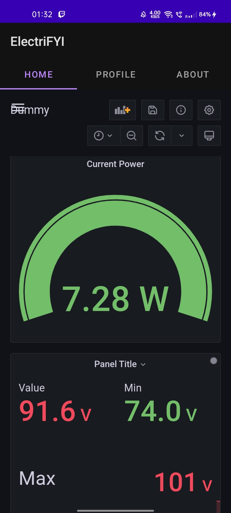

# ElectriFYI
## Develop Power consumer and Utility applications using android development and Grafana dashboard

In this digitized world, and the fast changing paradigm to electrical energy, it is important to visualize the electrical energy usage and making it easily accessible and available to the shareholders. In this projet we are developing to visualize and handle this architecture of power consumption by the utility as well as the users.

One of the best methods to understand energy consumption patterns is to visualize them. Various research on visualization of electric energy consumption. Visualization has two benefits. First, visualization does not need to use a complex technique to analyze data. Second, common people can understand the result of visualization easily.

### DESIGN AND PROBLEM FORMULATION
A smart meter is just like traditional electric meter with additional functionality to record information such as consumption of electric energy, voltage levels, current, and power factor. Smart meters can be made to  communicate the information to the consumer for greater clarity of consumption behavior, and electricity suppliers for system monitoring and customer billing.  
Smart meters allow the consumer to track their power usage in real time.

### POSSIBLE METHODS TO SOLVE THE PROBLEM
There are multiple ways in which we can make use of the smart meter utility and present each  consumer their daily power usage .\
Part 1 : Connecting Smart Meter to a Time series database\
The overall aim to to take the power usage data from the smart meter , store it in a time series database (in our case Prometheus ) and send it to the grafana utility which allows graphical analysis on the time- series data .
*Note : in our case for simulating the smart meter data we have taken TestDB data in Grafana*

Part 2 : Create a grafana Dashboard which takes this data and shows it in presentable graphical form in desktop application as well as android application. \
The grafana utility takes this data and allows us to perform various graphical analysis and turning that time series data in a presentable form which can be embedded in the desktop application for each user. 

### Process Pipeline
#### Planning
● Identifying target audience-  Power providers, Society level entities.\
● Defining basic deliverables and user requirements\
● Exploring Technologies \
● Choice of dashboard panels \
● Placement of dashboard panels \
● Platform \
● Web/standalone application\

#### Pre-Production
● Finalizing technology \
● Embedding Panels in application \
● Rough Layout of project code - Diagrams , Front end 

#### Production
● Desktop application - Packaging and forming Executable - Electron \
● Login Authentication - NodeJs, Firebase \
● Graphical Dashboards - Grafana \
● Front End - HTML CSS Javascript \
● BackEnd - NodeJs, Mysql \
● Git & Github for Version Control

#### Launch, Testing, Feedback and Update
●  To be done 

#### Tools and Tech Stack used to build the Desktop Application 
● Electron \
● NodeJs \
● HTML , CSS , Javascript   \
● Grafana \
● Mysql \
● XAMPP PHPMYADMIN \
● Visual Studio Code \
● Git & GitHub

#### Tools and Tech Stack used to build the Android Application
● Java  \
● Webview \
● Javascript \
● Grafana \
● Android Studio \
● Git & GitHub 

### Results and Analysis

#### Screenshots Desktop Utility Application

#### Screenshots Android Application 

### Conclusion and Future Scope

We have made a basic android and desktop application performing basic required functionalities . However , There are future possibilities that could be integrated with application . 
Game Based Energy Saving Incentive : User  may set their daily power consumption goals and can be rewarded with points if they use power below certain limit . 
Machine Learning : Apart of just displaying the voltage and energy data , we can apply ML techniques to work upon that data to : check unusual user power consumption , voltage fluctuations, power outages etc.

